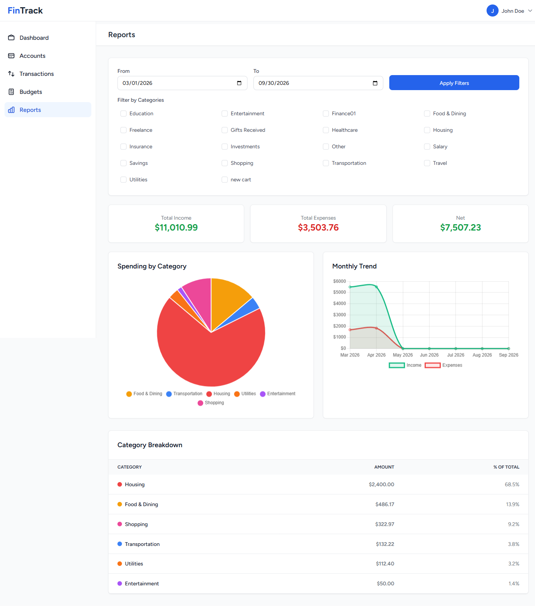
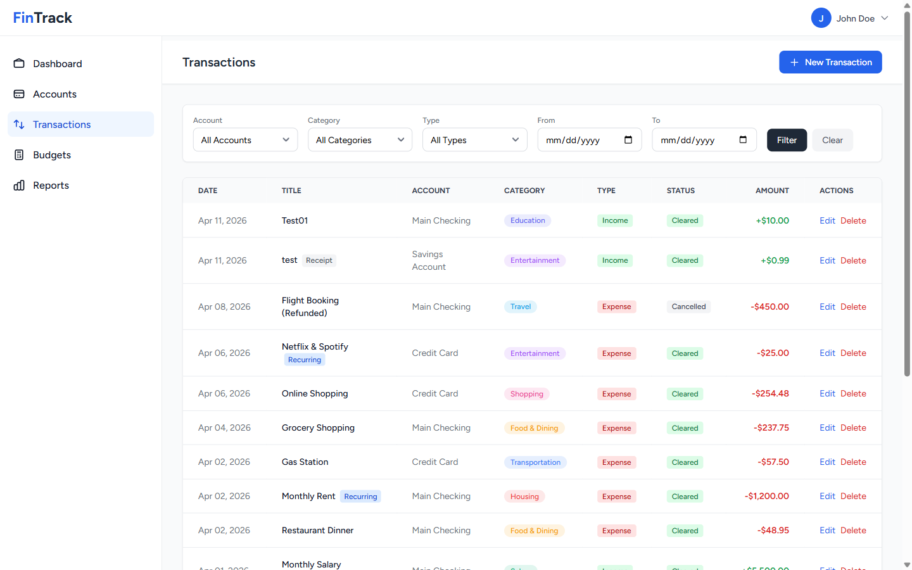
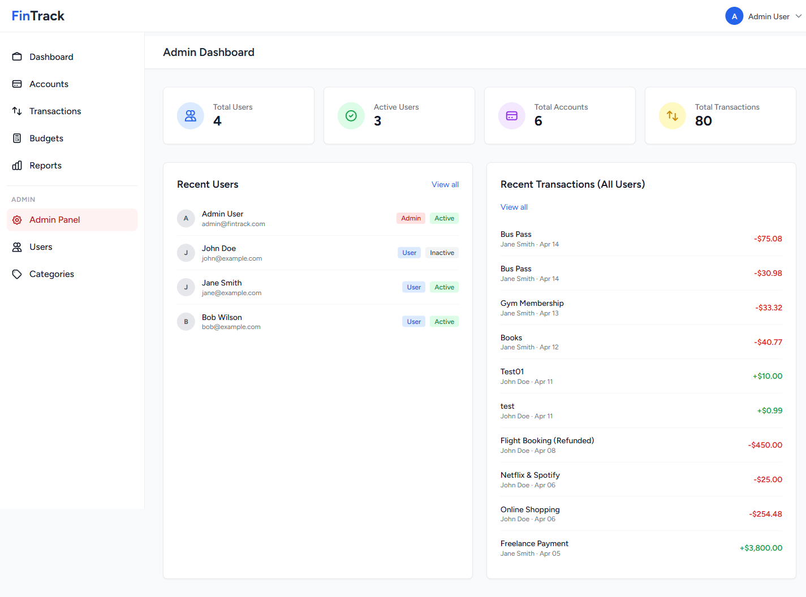

# FinTrack

A self-hosted personal finance tracker for people who want their money data on their own machine. Track accounts, log transactions, set category budgets, and share an account with a partner or housemate — without handing a third party read access to your bank.




## Why this exists

Most budgeting apps want bank credentials and a subscription. FinTrack is the opposite: a small Laravel app you run yourself, backed by a single SQLite file you can copy, back up, or delete. It started as a semester project and I kept building on it because I actually wanted to use it.

The interesting constraint is **shared accounts**. A joint account isn't just "two users see the same rows" — one person may own it, another may only be allowed to look. That's modelled as a many-to-many with a permission level on the pivot, and it's what most of the authorization logic exists to enforce.

## Features

- **Accounts** — checking, savings, credit, cash. Balances update automatically as transactions are created, edited, or deleted.
- **Transactions** — income/expense with category, status (pending/cleared/cancelled), notes, recurring intervals, and receipt image upload.
- **Budgets** — monthly per-category limits with live progress bars and over-budget warnings.
- **Reports** — date-range and multi-category filtering, spending-by-category pie chart, six-month income-vs-expense trend, and a breakdown table.
- **Account sharing** — invite another user to an account as viewer or editor; permissions are enforced server-side on every route.
- **Admin panel** — user management, category CRUD, and read-only oversight of all transactions, gated by role middleware.

| Transactions | Admin panel |
|---|---|
|  |  |

## Tech stack

| Layer | Choice |
|---|---|
| Framework | Laravel 13 (PHP 8.4+) |
| Auth | Laravel Breeze (Blade) |
| Database | SQLite |
| Frontend | Blade + Tailwind CSS 3, Flowbite, Alpine.js |
| Build | Vite 8 |
| Tests | PHPUnit |

## Quick start

```bash
git clone https://github.com/zakaria17amir/Fintrack.git
cd Fintrack
composer install
cp .env.example .env
php artisan key:generate
touch database/database.sqlite
php artisan migrate --seed
npm install && npm run build
php artisan serve
```

Open http://127.0.0.1:8000.

### Demo accounts

Created by the seeder. Change or remove them before deploying anywhere real.

| Role | Email | Password |
|---|---|---|
| Admin | `admin@fintrack.com` | `password` |
| User | `john@example.com` | `password` |

To develop with hot reload, run `composer run dev` — it starts the PHP server, queue worker, log tailer, and Vite together.

## Data model

Five domain tables plus Laravel's defaults.

```
User ──1:N──> Account ──1:N──> Transaction <──N:1── Category
 │                                  ^                   │
 │                                  │                   │
 └──────────1:N────────────────────-┘                   │
 │                                                      │
 └──1:N──> Budget ──────────────N:1─────────────────────┘
 │
 └──N:N──> Account   (account_user pivot, permission: viewer | editor)
```

- **`transactions`** is the wide table (13 columns) and exercises most of the type range: integer, boolean, date, timestamp, and three enums (`type`, `status`, `recurring_interval`).
- **`account_user`** is the sharing pivot, carrying a `permission` enum rather than being a bare join table.

**Money is stored as integer minor units** (cents), never floats, and divided by 100 only at display time. Floating-point currency arithmetic silently loses precision — `0.1 + 0.2 != 0.3` — and that is not acceptable in a ledger.

## Project structure

```
app/
  Http/Controllers/        User-facing controllers
  Http/Controllers/Admin/  Admin-only controllers
  Http/Requests/           Form request validation
  Http/Middleware/         Role gate for /admin
  Models/                  Account, Budget, Category, Transaction, User
database/
  migrations/  seeders/  factories/
resources/views/           47 Blade templates
routes/web.php             Application routes
tests/                     PHPUnit feature + unit tests
```

## Testing

```bash
composer run test
```

Current coverage is the authentication and profile suite that ships with Breeze. Domain coverage for transactions, budgets, and the sharing permission rules is the main open gap — see below.

## Roadmap

- [ ] Feature tests for transaction CRUD, budget rollover, and shared-account permission enforcement
- [ ] CSV import/export
- [ ] Multi-currency support
- [ ] Recurring transactions generated automatically rather than flagged manually
